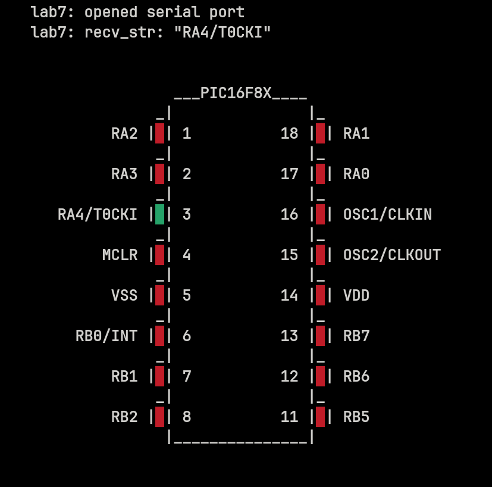

# lab7
“Physical foundations of computers” - Laboratory work No. 7

**Laboratory work No. 7 (April-May)**

Topic: *"Visualization of the operation of the microcircuit and receiving
requests from another computer."*

We are talking about the microcircuit for which laboratory work No. 6 was performed. In particular, attention was paid to the drawing with the designations of the legs of the microcircuit.

The answer to the question “Graphical representation and development of an interface for controlling a microcircuit” is the output of the corresponding program on the form drawing. In this case, it is necessary to provide for the possibility of changing the color "rectangles" corresponding to the legs of the microcircuit. Color change will be conditionally indicate a change in the signal at the terminals.

To manage color you need provide suitable control and display elements. To simulate work internal program of the chip, which exposes or reads from port combinations zeros and ones depending on the bit depth of the port, it is necessary to "develop a language management requests" (answer to the second question).
The request text must contain
port name and characters corresponding to the combination of zeros and ones (binary or 16-digit form).

"Visualization of exchange with another computer" means requests can come from another computer via a COM port (ports of 2 computers connected using a null modem cable).

